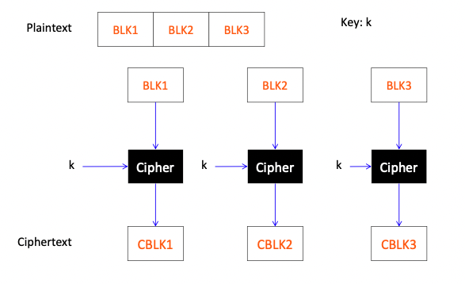
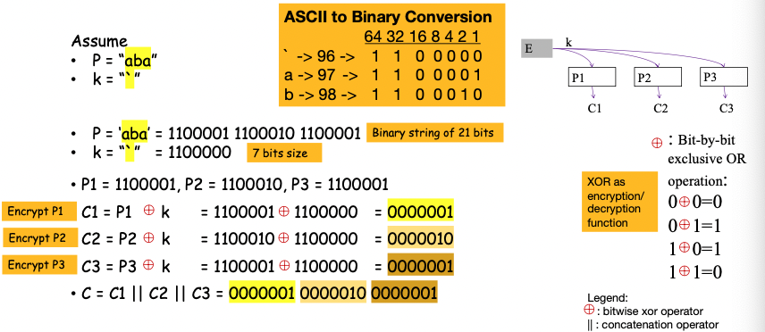
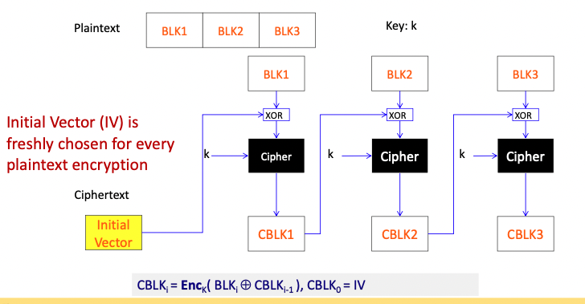
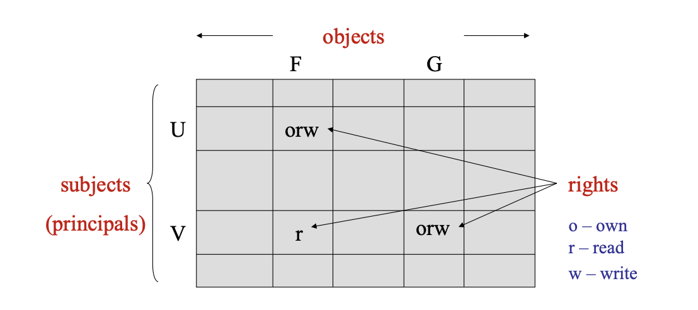
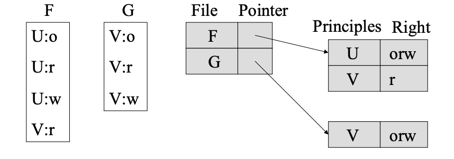
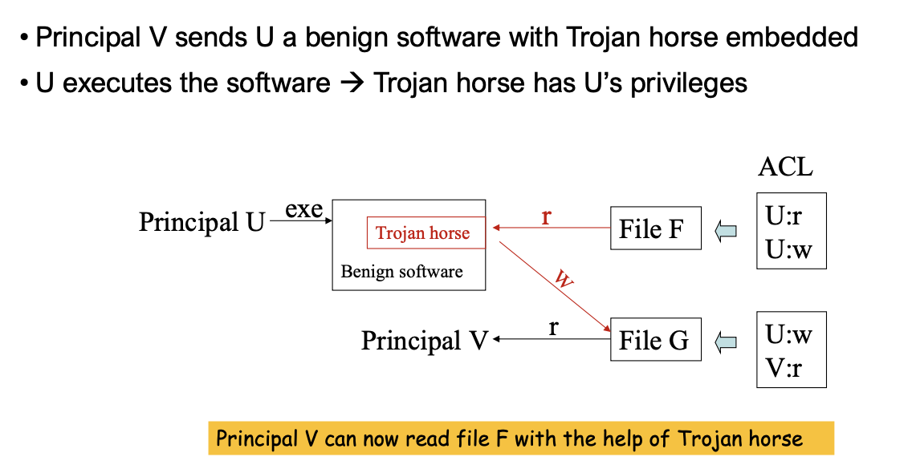
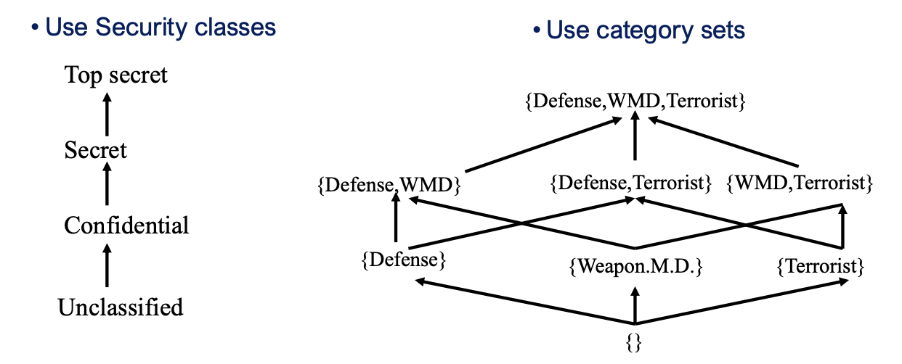
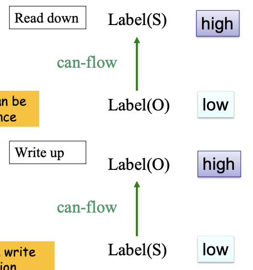
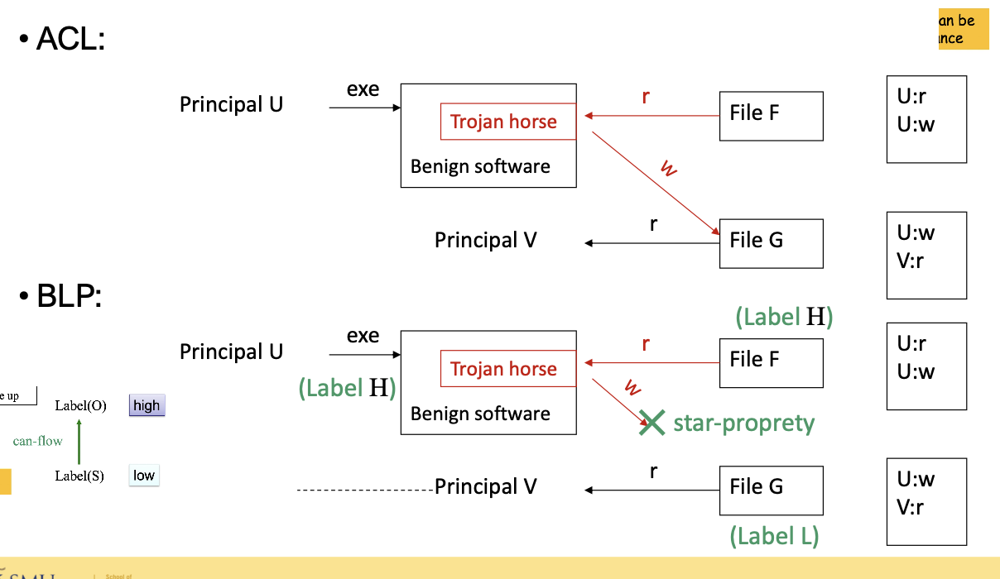
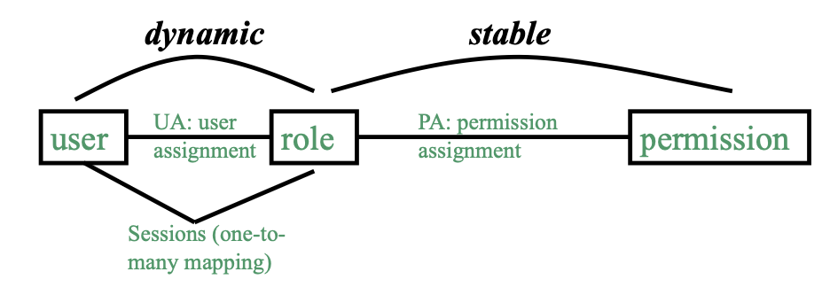

# CS440 Notes

## 01 Basic Concepts of Cybersec
### Definitions
- Remote Code Execution (RCE) attack: the execution of malicious code on a computer.
- Memory Management Unit (MMU): a computer hardware unit having all memory references passed through itself, primarily performing the **translation of virtual memory addresses to physical addresses**.
- Translation Lookaside Buffer (TLB): a memory cache that stores the recent translations of virtual memory to physical memory.
- Extended Instruction Pointer (EIP): a tracker for the address of the **current instruction** running inside the application.

### CPU Privilege (Protection Ring)
- Privilege = Order / Hierarchy
- CPU privilege is important to protect sensitive resources.

### Router
- The postman of the internet - on the arrival of an IP (network) packet, it makes aa routing decision based on the packet's destination IP address.
- It chooses the next router to forward the packet to based on a routing table.

### CIA Triad
Integrity, condentiality and availability.

### Kerckhoff's Principle (1883)
Only the key should be kept secret, while the algorithm itself should be publicly known.

## 02 Symmetric Key Encryption (Confidentiality)
### Definitions
- Unconditional security: a cryptosystem is unconditionally secure if it cannot be broken even with infinit computational resources.

- Two main approaches of encryption: (1) substitution, (2) shuffle, permutation or transposition.

### One-Time Pad (aka Vernam Cipher)
Uses exclusive OR with a random bitstring that has the same length as the plaintext.

Cons:
- It is impractical as there is a need for synchronization and an unlimited number of keys.

### Block Ciphers
A deterministic algorithm operating on fixed-length groups of bits, called blocks.

- As in the case of stream ciphers, most encryption methods encrypt bits one by one (stream ciphers). Block ciphers, on the other hand, encrypt 128 bit blocks with a symmetric key of predetermined length: 128, 192, or 256 bits.
- A 128-bit block cipher brings 128 bits of plaintext and encrypts it into 128 bits of ciphertext. Where the amount of plaintext is less than 128 bits, in this example, the cipher will employ methods to reconcile the difference (padding schemes).

Pros:
- High diffusion
- Strong tamper resistance without detection 

Cons:
- Slower encryption speed since the entire block must be captured for encryption/decryption
- A mistake in just one symbol could alter the whole block

#### Example
- Symmetric block cipher: Advanced Encryption Standard (AES)

### Modes of Encryption
#### Electronic Code Book (ECB)

* XOR is not the actual encryption method used in AES; it's way more complex than this.

#### Cipher Block Chaining (CBC)

- The initial vector (IV) does not need to be a secret.
- IV is considered the first block in the ciphertext.
- Encryption must be sequential and decryption can be parallel.

Encryption: $C_i = Enc_k(P_i \oplus C_{i-1}), C_0=IV$
Decryption: $P_i = Dec_k(C_i) \oplus C_{i-1}, C_0=IV$

### Cryptanalysis
Cryptanalysis is used to breach cryptographic security systems and gain access to the contents of encrypted messages, even if the cryptographic key is unknown.

- **Ciphertext-only attack**: Cryptanalyst only knows ciphertext
  - Can apply **frequency analysis** when substitution ciphers are used - it makes use of the idea that certain letters occur with varying frequencies.
- **Known plaintext attack**: Cryptanalyst happens to know some plaintext-ciphertext pairs (but he cannot choose what to know)
- **Chosen plaintext attack**: Cryptanalyst knows some plaintext-ciphertext pairs for plaintext chosen by himself
  - E.g. The attacker takes a public key using RSA (asymmetric) and pre-encrypts plaintexts they choose using the known public key. They can then compare the generated ciphertexts with the stolen ciphertext. Once a match is found, the corresponding plaintext is identified as the original message.
- **Chosen ciphertext attack**: Cryptanalyst knows some plaintext-ciphertext pairs for selected ciphertext chosen by himself

### Brute-forcing a 256-bits Key
If you can get the message from the ciphertext generated using AES, you can find the AES key.

- Brute-forcing a standard AES key is computationally infeasible with our current computing power.
- It takes $3.5 * 10^55$ years (or billions of years) to crack AES with 256-bit key using one of the fastest supercomputers in 2019.

#### Moore's Law
Computing power doubles every 18 months while the costs of integrated circuits stay constant.

## 03 Asymmetric Key Encryption (Confidentiality)
### Definitions
- Composite number: is a positive integer that can be formed by multiplying two smaller positive integers
- Co-prime number: (or relatively prime number) are numbers that have their HCF (Highest Common Factor) as 1
  - 15 and 8 are co-prime as their respective factors are 1, 3, 5, 15 and 1, 2, 4, 8 - their only factor in common is 1

### Cons of Symmetric Keys
- Require a secure key distribution channel
- Not scalable
  - Among n users, there are n(n-1)/2 different secret keys in total
  - n-1 secret key(s) stored by each user

### Asymmetric Cryptosystem (Public Key Encryption)
It should be computationally infeasible to compute the private key from the public key.

#### RSA
Rivest-Shamir-Adleman

## 04 Data Authentication and Integrity

### HMAC
A type of MAC.

$MAC = \delta = Hash(K||M)$
- K: the secret key shared between Alice and Bob (can be exchanged via hybrid encryption)
- M: The message exchanged

To verify the integrity, he computes his own version of HMAC in the same way as Alice. If the outcome equals δ, the message is intact.

A third party that does not know the secret key K cannot manipulate the HMAC.

#### Limitation of HMAC
- The need of a secure channel to exchange a secret.
- Inability to provide non-repudiation.
  - Both Alice and Bob can generate the MAC value from M as they share the same MAC key. Therefore Alice can accuse Bob generating $MAC = H(k,M)$ by himself.
  - This repudiation problem can be fixed by using a digital signature instead.

### Digital Signature
- Use asymmetric cryptography
- Provide authenticity and integrity services for messages transmitted through a non-secure (public) channel
- Also provide non-repudiation service
- Equivalent to traditional handwritten signatures and typically more difficult to forge than handwritten signatures

 

$sig = H(M)^d \mod n$
- $(e,n)$: RSA public key
- $d$: RSA private key
- This formula means - hash of M, raised to the power of d, modulus n

If Alice is the one who generated the RSA public and private keys, this signature can only be generated by her.

Alice then passes both $M$ and $sig$ to Bob over a public channel.

To let Bob verify the digital signature:
1. Computes $H(M) = sig^e \mod n$ using the received $sig$.
2. Verifies integrity of message by comparing $H(M)$ against $H(M)_received$.
3. If $H(M)$ and $H(M)_{received}$ match, verification passes.

Note: *Anyone* can verify Alice's public key, not just Bob.

**Follows the property of asymmetric cryptosystem**
Encryption: $x = y^e \mod n$
Decryption: $y = x^d \mod n$

In the case of digital signatures:
Signing: $sig = H(M)^d \mod n$
Verifying: $H(M) = sig^e \mod n$

## 05 Digital Certificate

## 06 User Authentication and Identity Management

## 07 Access Control

An access control model involves three elements: *subject, objects, rights*.

- Access control comes *after* authentication, where it defines the users who are **authorized** (after being authenticated).

## Three Models
1. DAC: the access rights are at the discretion of the resource owner
2. MAC: the access rights are mandatorily defined based on certain policies, not at one's discretion.
3. RBAC: the access rights are defined according to the users' roles.

### Comparisons
- DAC: widely used in operating systems; the owner of an object has full control over the propagation of access rights for the object.
  - Group concept in DAC only concerns with access right of the group whom the owner belongs; and the rest are others
  - It doesn’t state anything about access right of other groups
  - Widely used in most operating systems
- MAC: augments DAC using security labels attached to subjects and objects; suitable for information systems where there is a formalized notion of security clearances.
  - Security labels are used for both subjects and objects
  - Access control is regulated by can-flow relationship between subject label and object label
  - Used in highly sensitive information systems
  - Used in SE Linux
- RBAC: A general access control model for management of security in companies and organizations; flexible and easy to use.
  - Roles are used for users
  - Access control is regulated by user’s roles
  - Suitable for commercial applications in
which users have well-defined roles

## Discretionary Access Control (DAC)
Can be broken down into:
1. User
2. Principals: represents the identity of the user
3. Subjects: a program running on behalf of the principal
4. Objects: anything on which a subject can perform operations
  - E.g. passive objects (file, directory, memory segment), sometimes subjects can be objects too (executing `./command.sh` on linux that provides a call to another `ls`, e.g. through a bash file that contains the same command)

**User-Principals**
- User-Principals have a one-to-many mapping.
- System authenticates user in the context of the principal.
- E.g. User (Prof Pang) -> Principal (e.g. dean, faculty, staff)

**Principal-Subjects**
- One-to-many mapping.
- If all subjects of a principal have the same rights, they are often treated the same as principal.
  - What does it mean by same rights?
- E.g. Email, MS Word, database

### Visualization of DAC

**Access Control Matrix (ACM)**
DAC can be represented by an ACM:

**Access Control List**
It can also be represented by columns, with each object poiting to different principles. It is used especially when the ACM turns out to be sparse.

Example of ACL: file system in OS (e.g. `ls -a`)

### ACL Commands
`chmod [ugo]+-[rwx] filename(s)`
- `[ugo]`: user/group/owner
- `[rwx]`: read/write/execute

Another method to set access for user, group and owner all at once:
`chmod 774 file1`
- E.g. 774 represents 7-7-4 = `111 111 100` (rwx, rwx, r)
- `file` represents the file you want to change access for

## Security Problems of DAC

## Mandatory Access Control (MAC)
- MAC augments DAC using security labels attached to subjects and objects.
  - Security label to subject <-> security clearance
  - Security label to object <-> security classification
- Information flow strictly follows those paths satisfying policies predefined according to labels.
  - E.g. Label 1 can flow to Label 3, Label 2 cannot flow to Label 3
- Users *cannot create/modify security labels* which are assigned by Admin only.
  - Big difference from DAC

### Label Hierarchy
Aka can-flow relationship (lattice).

- `Unclassfied -> Confidential` have total order as they are comparable.
- `{} -> Defense` have total order as they are comparable.
- `{Defense} -> {Weapon.M.D.}` have partial order as they are not comparable.

### Bell and LaPadula (BLP) Model
The right diagram in the lattice image above.

- A formal MAC model which lays out the rules for concrete access policies based on security labels.
- The principles define allowable information flows in order to maintain data secrecy (confidentiality).
- Does not address integrity.
- Key part in US Department of Defense (DoD) security evaluation criteria.

#### Two Mac Rules
Think of the following as a student submitting an assignment to a professor. The student (the subject on the lower level) can write the assignment, and then submit this assignment (the object on the higher level) for the professor to read.

1. Simple-security (read-down): Subject S can read object O only if label(O) is lower than or the same as label(S).
2. Star property (write-up): Subject S can write object O only if label(O) is higher than or the same as label(S).

#### ACL vs ACL + BLP
- ACL: AC decisions are made based on principals
- ACL + BLP: AC decisions are made based on principals + security labels of subjects and objects

#### Star property prevents Trojan horses

- label(H) (higher level) cannot write to label(l) (lower level)

### Cons of MAC
- MAC was originally developed for military use
  - Hierarchical structures: top secret, secret, confidential, unclassified
- There are significant differences between commercial and military information security
  - Data items (objects) may have different degrees of sensitivity: public, proprietary, internal
  - No formalized notion of clearances (subjects) -> no dominance (can-flow) function -> access is less regulated

## Role-Based Access Control (RBAC)

A general access control model for management of security in companies and organizations
- General, flexible and easy-to-use
  - Addresses many different security needs in commercial and government sectors with
minimal customization
  - Identifies flexible yet easy-to-use application-independent facilities
  - Maps naturally to organization’s structure
- Support at application level (SQL, Oracle, WebCT...)

### Terminology
- User: An individual that has access to the system.
- Role: A named job function within the organization the controls the system.
- Permission: An approval of a particular mode of access to one or more objects.
- Session: A mapping between a user and an activated subset of set of roles to which the user is assigned.

RBAC also has simpler security management. Security management based on roles rather than permissions is simpler:
